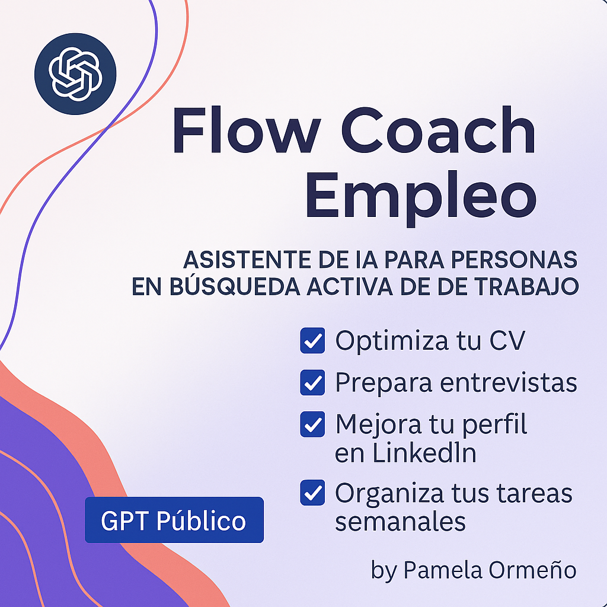

# 🎯 Flow Coach Empleo (GPT Público)
<p align="center">
  ⭐ Si te gusta este proyecto, <a href="https://github.com/PamelaOrmeno/chatGPT-flow-coach-empleo/stargazers">¡dale una estrella en GitHub!</a> ⭐
</p>

<p align="right">
  
</p>


Asistente de IA personalizado con ChatGPT, diseñado para personas en búsqueda activa de empleo. Te ayuda a organizar entrevistas, optimizar tu CV, mejorar tu perfil de LinkedIn y mantener el foco en tu proceso de búsqueda laboral.

> 🔎 Este GPT nace desde mi experiencia real enfrentando la búsqueda de trabajo, buscando una herramienta que fuera práctica, cercana y sin rodeos.

<p align="center">
    
</p>

---

## ✅ Funcionalidades principales

- ✅ Optimiza tu CV con recomendaciones claras
- ✅ Prepara entrevistas con preguntas frecuentes y simulaciones
- ✅ Mejora tu perfil de LinkedIn con foco estratégico
- ✅ Organiza tus tareas semanales y tu progreso

---

## 🧠 Tecnologías utilizadas

- ChatGPT (OpenAI GPT-4o)
- Prompt Engineering
- Instrucciones personalizadas en interfaz GPT
- GitHub para documentación y versiones

---

## 🚀 ¿Cómo crear tu propio Flow Coach Empleo?

Sigue estos pasos para crear una copia personalizada en tu cuenta ChatGPT:

1. Ve a [https://chat.openai.com/create-gpt](https://chat.openai.com/create-gpt)
2. Haz clic en "Crear un GPT"
3. Completa los campos con los siguientes datos:
   - **Nombre:** Flow Coach Empleo
   - **Instrucciones del sistema:** Usa las contenidas en [`instructions.txt`](./instructions.txt) de este repositorio
   - **Visibilidad:** Puedes mantenerlo privado o público
4. Personaliza el ícono o descripción a tu gusto
5. Guarda y comienza a usarlo 🎉
<br>

💡 Nota: Para crear tu propio GPT personalizado, necesitas una cuenta de pago de ChatGPT Plus.

➡️ Sin embargo, puedes **usar este GPT sin costo** desde la GPT Store, incluso con cuenta gratuita:
👉 [Accede gratis a Flow Coach Empleo desde GPT Store](https://chatgpt.com/g/g-68793fc52b64819187754402388cf360-flow-coach-empleo-publico)

---

## 📂 Estructura del repositorio

```

chatGPT-flow-coach-empleo/
├── README.md
├── instructions.txt       # Instrucciones utilizadas para la creación del GPT
└── assets/
    └── preview-flow-coach-empleo.png  # Imagen promocional (opcional)
```

---

## 🌐 Accede al GPT

🧩 Usar Flow Coach Empleo directamente desde GPT Store

## 🤝 Contribución

¿Tienes ideas para extenderlo? ¿Te gustaría adaptarlo para otros sectores o países?

Haz un fork del repositorio

Abre un issue con tu sugerencia

Comparte tu versión en LinkedIn y etiquétame 😉

## 💬 Contacto

📧 LinkedIn [Pamela Ormeño](https://www.linkedin.com/in/pamelaormeno/)
<br>
📧 [pamelaormeno@gmail.com](mailto:pamelaormeno@gmail.com)
<br>
💻 [Repositorio principal de GPTs](https://github.com/PamelaOrmeno/chatGPT-flow-coach-empleo)

## 📄 Licencia

MIT © 2025 Pamela Ormeño. Uso libre con atribución.
